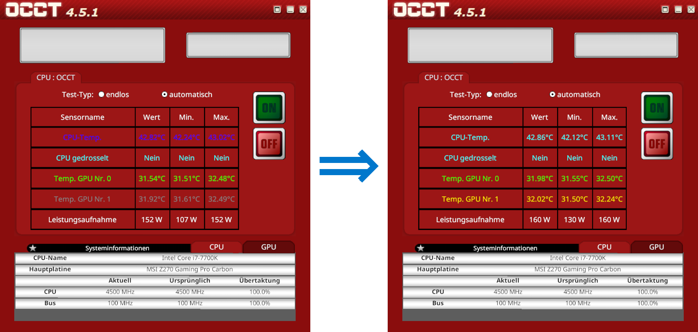

PCBS OCCT Font Color Patch
===

(tested for PCBS x64 v1.15.3 on Steam)

## **Background**
Whenever I use the OCCT app in PC Building Simulator I struggle to read the CPU's temperature due to the low contrast between the blue font and dark red background\*. After contacting the developer to ask for a fix (which for them amounts to changing one specific occurence of the word `blue` in their source code to some other color name), waiting three months and five updates and finding out that nothing has changed, I decided to patch the game myself and share the patch with other players who might enjoy a readable OCCT app as well.

\* contrast ratio 1.04:1, like, wtf?! All the other vibrant colors in OCCT have a contrast ratio of at least 5:1 to the background.

## **Usage**
To change the font colors in the OCCT app, store the script `occt_colors.ps1` somewhere on your computer, open up a PowerShell session in the folder where the script resides, and run the script via `.\occt_colors` with any combination of the following arguments:

- `-CpuTemp <color>` (color for CPU temperature row)
- `-CpuThrottled <color>` (color for CPU throttling row)
- `-GpuTemp1 <color>` (color for the first GPU temperature row)
- `-PowerDraw1 <color>` / `-GpuTemp2 <color>` (color for the second GPU temperature row, or power draw row in single GPU rigs. Both arguments refer to the same color in the game. If both are specified, `-PowerDraw1` has precedence over `-GpuTemp2`.)
- `-PowerDraw2 <color>` (color for power draw in dual GPU rigs)

Available color names are: `Black`, `Blue`, `Cyan`, `Gray`, `Grey`, `Green`, `Magenta`, `Red`, `White`, `Yellow`. The current OCCT color settings can be displayed with `-Show` and the colors can be reset to their original values with `-Reset`.

The script tries to locate PCBS automatically, but this only works for the Steam version of the game. For other versions you can try specifying the path to PCBS's installation directory with `-PcbsDir <path>`.

The script also checks for compatibility by computing MD5 hashes of the relevant regions in the DLL and comparing them to known hashes. There is no setting to disable this check.

Running the script with `-?` will show a similar usage message.

## **Backups**
**Definitely** create a backup of your save games (`Saves` folder in the installation directory of PCBS). Steam can repair game files, but it can not repair save games. And even though my script doesn't touch your save files, PCBS has the nasty property of destroying save files if it is functional enough to load into the main menu but defective enough to not load into the game (which I found out while working on another mod, ouch).

## **Example**
```ps1
.\occt_colors -CpuTemp Cyan -GpuTemp2 Yellow
```



## **How the patch works** (if you are interested, not needed to use the patch)
The OCCT app in PCBS is implemented in the `OCCTApp` class in the global namespace of the .NET assembly `PC Building Simulator\PCBS_Data\Managed\Assembly-CSharp-firstpass.dll`. It gets its colors from the `OCCTApp::m_colours` array initialized in the constructor and accessed by `OCCTApp::Start` and `OCCTApp::AddSensor`.


The colors `Color.[colorname]` are static read-only properties returning values of type `struct Color`. They are defined externally in `UnityEngine.CoreModule.dll`. Properties in C# are translated into getter and setter methods at compile-time, and accessing such a property translates into a `call getter/setter` instruction in the *Common Intermediate Language* (CIL), the "machine" code of the .NET framework. The byte code of such an instruction consists of an *instruction byte*, `0x28` (`call`), followed by a 4-byte little endian *runtime identifer* (RID) referencing the method to be called. The most significant byte of the RID specifies the ID of a lookup table in the assembly, and the remaining three bytes specify the index into the lookup table where the method reference is stored. Since we are calling an external method, its reference is stored in the `MemberRef` lookup table (`0x0A`). And in our case the `MemberRef` table has less than 0x10000 entries, meaning all RIDs are of the form `0x0A00yyxx` (or `xx yy 00 0A` in on-disk order).

To change the colors in the OCCT app we just need to change which `get_[colorname]` getters are called, i.e. we need to change the `xx` and `yy` parts of the RIDs following the `call` instructions corresponding to accesses of `Color.[colorname]` properties. In order to do so we first need to know their offsets into the DLL file, and secondly, we need to know the RIDs of all `get_[colorname]` getters available to us (referenced in the `MemberRef` table). Luckily, the .NET decompiler [dnSpy](https://dnspy.org/ "dnSpy.org") allows us to easily obtain all this information:

1. By opening `Assembly-CSharp-firstpass.dll` in dnSpy, right-clicking the `OCCTApp` constructor and choosing `Edit Method Body...` we find the *method header offset* and the *instruction offsets* of all instructions comprising the constructor. The instruction offsets are relative to the first byte after the method header, which is 12 bytes in size. And the `xx` and `yy` bytes are the two bytes directly following the `call` instruction byte. Therefore, the offsets into the DLL of all `xx yy` to be changed are given by (all numbers in hexadecimal)

       method header offset + sizeof(method header) + call instruction offset + 1
             (101428)                 (0C)              (0E,1F,30,41,52,63)

   You can see those bytes highlighted in yellow orange in the image above. The sixth color does not seem to have any purpose in the code, so I didn't include an option in my script to change it.

2. To obtain all `get_[colorname]` RIDs available in `Assembly-CSharp-firstpass.dll` we navigate to `PE/Storage Stream #0/Table Stream/MemberRef` in dnSpy. After copying all rows as text (`Ctrl+A, Ctrl+Shift+C`) we can filter them for all methods with name `get_[colorname]`:

       RID         Info
       0x0A0004AA  get_black
       0x0A000C31  get_blue
       0x0A000DE0  get_green
       0x0A000BE8  get_cyan
       0x0A0006F1  get_red
       0x0A00106C  get_magenta
       0x0A0006F2  get_yellow
       0x0A00049A  get_white
       0x0A000F9D  get_gray
       0x0A00106B  get_grey

   Without checking I am fairly confident that all those getter methods correspond to the static color properties of the `Color` struct from `UnityEngine.CoreModule.dll` (and not to some other random property `[colorname]` defined somewhere else).

Now that we have all DLL offsets of the bytes to be changed and all RIDs that we can change them into, all that remains is to write a program/script that does that for us... oh right, I already did that. And I threw in PCBS auto-localization and compatibility checking for good measure.

#### Sources
- [The .NET File Format](https://www.codeproject.com/Articles/12585/The-NET-File-Format "The .NET File Format - CodeProject.com")
- [Understanding Common Intermediate Language (CIL)](https://www.codeproject.com/Articles/362076/Understanding-Common-Intermediate-Language-CIL "Understanding Common Intermediate Language (CIL) - CodeProject.com")

## **Other Notes**
 - I decided to use PowerShell for four main reasons:

   1. It is terribly unfit for binary file manipulation (using a programming language designed for that purpose just wouldn't be as much fun),
   2. it is open in the sense that everone can look into the script and convince oneself that it doesn't do anything malicious,
   3. with its access to the .NET framework it basically is C#, but without the need to compile, and
   4. it is avaialable on every modern Windows machine without having to install any additional software (like Python, Lua, Ruby, etc.).

 - dnSpy can also be used to edit methods and classes in .NET assemblies directly in C# without having to read or write CIL assembly. You could probably make the RankApp show actual 3DMark scores instead of pseudo scores... That might actually be a really cool idea now that I think about it :D